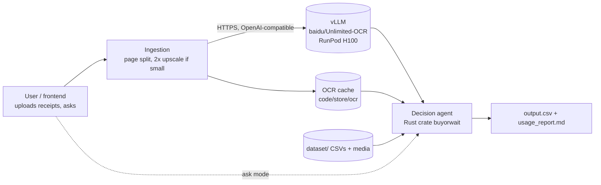
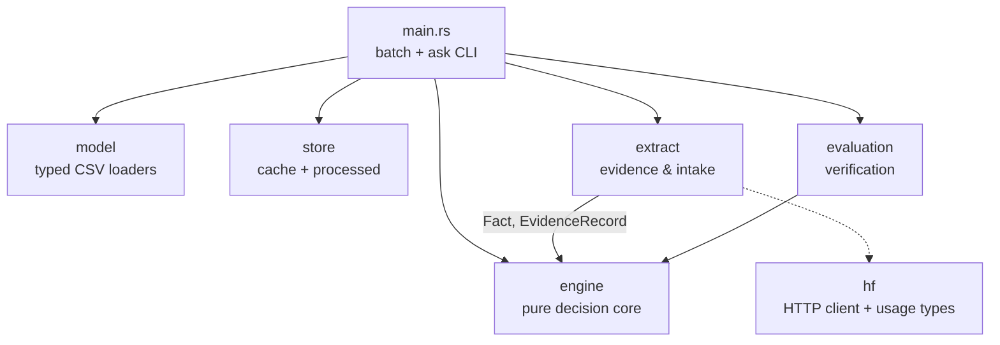
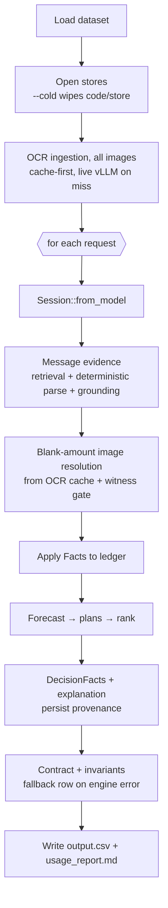
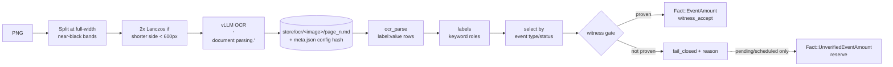
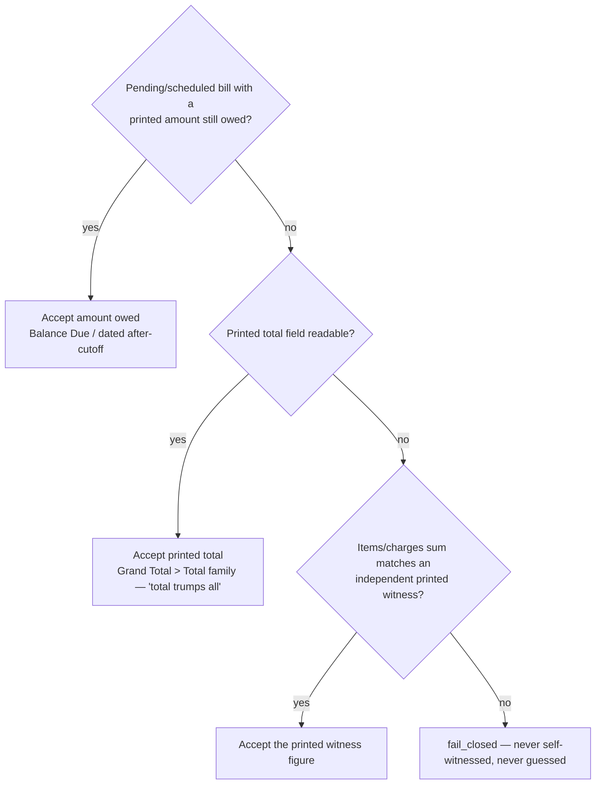
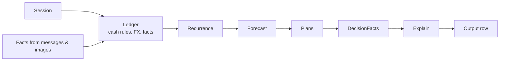
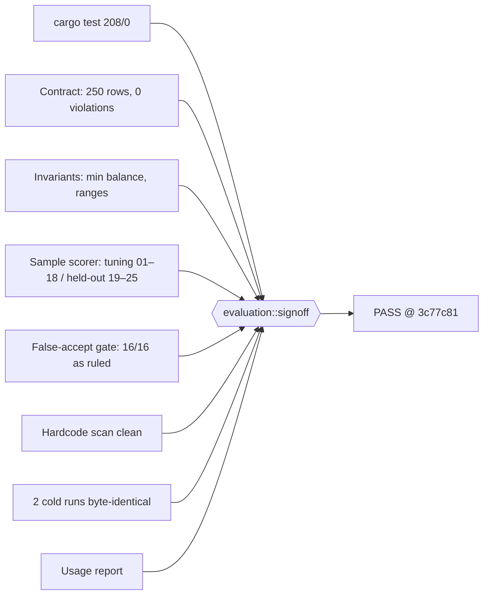

# Buy or Wait? — README: setup, approach and architecture

For every purchase or payment request, this agent decides how much is safe to pay today, whether the user can afford it (now, with a plan, later, or not at all), and which payment method, schedule and spending changes to recommend. The output goes to `output.csv`.

> The full design document with LaTeX/TikZ diagrams is [`architecture.tex`](architecture.tex) (compiled: [`architecture.pdf`](architecture.pdf)). This page is the README-style summary, with Mermaid diagrams.

**Revision:** `main@64535a9`. Verifier sign-off is on `7b68395`, and the final confirmation cold run passed sign-off.

**Final run:**
- 250 decisions, 0 contract violations, 0 invariant violations.
- 0 wrong image figures.
- Cold and warm runs gave byte-identical `output.csv` (sha256 `a9b952bb…`).
- 17 OCR calls, 43,012 tokens (172 per request), ≈ $0.04 total.

## Setup

**Prerequisites**
- Rust stable toolchain with Cargo (developed against 1.96).
- `dataset/` present as shipped. Run all commands from `code/`, because paths are relative.
- For a `--cold` run, an OCR endpoint: `baidu/Unlimited-OCR` served by vLLM on any NVIDIA GPU. A warm run can reuse the cached OCR in `code/store/ocr/`.
- No `HF_TOKEN` or other API key is needed for the submitted configuration.

**1. Start the OCR server** (the POC used a RunPod H100; any ≥ 8 GB NVIDIA GPU works):
```bash
docker run --rm --gpus all --network host --ipc host \
  vllm/vllm-openai:unlimited-ocr-cu129 baidu/Unlimited-OCR --trust-remote-code \
  --logits_processors vllm.model_executor.models.unlimited_ocr:NGramPerReqLogitsProcessor \
  --no-enable-prefix-caching --mm-processor-cache-gb 0 --host 0.0.0.0 --port 8000
```
- **RunPod:** set container image `vllm/vllm-openai:unlimited-ocr-cu129`, put the arguments above (from `baidu/Unlimited-OCR` onward) in the start command, and expose HTTP port 8000.
- **Check:** `GET <base>/v1/models` should list `baidu/Unlimited-OCR`.

**2. Configure** `code/.env` (gitignored; never commit it):
```bash
OCR_BASE_URL=http://<host>:8000/v1     # e.g. https://<pod>-8000.proxy.runpod.net/v1
# OCR_MODEL=baidu/Unlimited-OCR        # default
# OCR_API_KEY=...                      # only if your endpoint requires one
```

**3. Build, run and verify** (from `code/`):
```bash
CARGO_TARGET_DIR=target cargo build --release
CARGO_TARGET_DIR=target cargo run --release -- --cold     # writes ../output.csv + evaluation/usage_report.md
CARGO_TARGET_DIR=target cargo test                         # unit, scenario and e2e fixture tests
CARGO_TARGET_DIR=target cargo run --release -- verify signoff --output ../output.csv --usage evaluation/usage_report.md
bash final_run.sh                                          # cold + warm determinism check + sign-off + code.zip
```
- **Other options:**
  - `--requests ../dataset/sample_requests.csv --out /tmp/s.csv` scores against the 25 solved samples.
  - `ask` runs an interactive single request.
- **Caution:** `--cold` wipes `code/store/`, and `verify signoff` re-checks the persisted image reads and evidence there. Run sign-off after a full run, against an intact `code/store/`.

## Approach overview

1. **Reconstruct cash, then forecast. No model makes the decision.** A deterministic Rust engine:
   - rebuilds each user's ledger from `financial_events.csv`:
     - settled rows are in the balance;
     - pending debits are reserved;
     - pending credits are ignored until they settle;
     - scheduled rows and confirmed salary count on their dates;
     - FX uses the settlement-date rate;
   - detects recurring streams only where history supports them;
   - projects the balance day by day against `minimum_balance_to_keep`.
   - **Safe amount** = the minimum headroom over the horizon.
   - **Earliest full-payment date** = the first day from which the headroom never drops below the request.
2. **Search plans and rank them the way the spec says.**
   - **Candidates:** full, each supplied installment option, a two-payment partial plan, wait, and up to three spending changes on permitted flexible events.
   - **Safety:** each candidate is replayed day by day and dropped with a reason if it breaches the minimum balance, a preference or the deadline.
   - **Ranking:** meets the deadline → no spending changes → lowest cost → earlier start → fewer payments.
   - **Explanations:** templates filled only from the recorded `DecisionFacts`.
3. **Treat messages and images as untrusted evidence.**
   - **Messages:** a deterministic parser handles them. Every number must literally appear in the message, and embedded instructions are ignored. Conflicts resolve as cancellation/settlement/amendment > newer same-source record > settled event > safer interpretation.
   - **Images:**
     - **Reading:** at ingestion, stitched pages are split, small pages are upscaled 2×, and each page is OCR'd **once** by `baidu/Unlimited-OCR`, then cached.
     - **Mapping:** the model only transcribes. Rust maps printed labels to meaning with fixed keyword lists (Grand Total > Total; Balance Due; "Amount due after ⟨date⟩"; subtotals are never totals; change, cash tendered and "Due Date" columns are ignored).
     - **Acceptance:** a figure is accepted only through a **witness gate**: a printed total (or, for an outstanding bill, the printed amount still owed), or a line-item sum confirmed by an independent printed figure such as the amount in words. Anything else **fails closed** and is never guessed.
4. **How we got there.**
   - **The finding:** an audit of the first design, where HF vision-language models filled fixed JSON fields, showed the models *read* every final amount correctly but *mis-mapped* them (invented totals, balances and cutoffs).
   - **The switch:** we moved to "OCR transcribes, Rust interprets", compared OCR modes on all 16 images, and fixed the serving setup to one that gives byte-identical results.
   - **Removal:** the old HF VLM and Anthropic paths were then removed from the codebase.
   - **Rulings:** per-image rulings (e.g. cropped page → fail closed; "total trumps all" except amounts still owed on pending bills) are recorded in `RULES.md`.
5. **Verify before shipping.** `evaluation::signoff` gates every release:
   - contract validation;
   - forecast invariants;
   - a false-accept gate on image facts;
   - a check that shipped rows equal re-derived engine rows;
   - a hard-coded answer scan;
   - usage report sections;
   - byte-identical cold/warm runs.

   Sample requests 01–18 were used for tuning, and 19–25 were held out, reported as pass counts only.
6. **Built with [atrium](https://github.com/nativelite/atrium), my own agentic harness.** atrium is "tmux for coding agents": a multi-agent terminal that hosts real CLI agents (here, Claude Code) in switchable, splittable panes. The whole solution was developed by an atrium **fleet** (`atrium.fleet.json`, kickoffs and rules in [`fleet/`](https://github.com/JSBtechnologies/buy-or-wait/tree/main/fleet)), with me supervising and making every product ruling.

   ```mermaid
   flowchart LR
     H((Me<br/>rulings)) --> L[lead<br/>coordinates, no code]
     L <-->|board + bus| AN[analyst<br/>RULES.md]
     L <--> EN[engine<br/>ledger/forecast/plans]
     L <--> EX[extraction<br/>messages/evidence]
     L <--> ML[ml-engineer<br/>OCR + labels + gate]
     L <--> VE[verifier<br/>tests + sign-off]
     L <--> IN[integrator<br/>merges, runs, zip]
     EN & EX & ML & VE -->|branches| IN --> M[(main)]
   ```

   **Why I used it:**
   - **Parallel specialists.** A 24-hour solo challenge needs parallel specialists without losing control. Each agent owns specific files, works in its own git worktree, commits on its own branch, and only the integrator merges.
   - **Visible work.** Every agent is a pane I can watch, steer or take over, unlike invisible background sub-agents. The status chrome shows who is working, who is waiting on me and who is idle.
   - **Audit trail.** Decisions and evidence travel on a structured control plane instead of chat scroll-back, so the whole process leaves a trail. That includes the per-turn `log.txt`, board entries such as `ruling.*` and `decision.*`, and the bus history.

   **What's cool about it:**
   - **Control plane (`atrium ctl`):** a shared **board** with claims and leases (`board claim`, `state.<agent>` handoffs) and a pub/sub **bus** with topics. Questions can be routed to a specific role (`--decision --to lead`), so design questions reach the coordinator before the human.
   - **Trust policy with ceilings** (`plan < accept < automode < skip`). Planners ran read-only in plan mode while the OCR work executed, and a worker can never raise its own permissions.
   - **Fleet files.** A whole team relaunches from `atrium.fleet.json`, and each role resumes from its board state after context compaction instead of starting over.
   - **Agent-aware panes:** borders and the status bar reflect each agent's real session state.
   - **Zero third-party dependencies,** built on the nativelite stack (pty, rawterm, ansi, vterm, agsess), with Windows ConPTY as the reference platform.

   **In practice on this project:**
   - The fleet reverse-engineered the decision rules and built and tuned the engine.
   - It ran the OCR experiments, and caught and fixed real bugs: contaminated shared build caches, a rent-change rule scaling a one-off balance, and invented cutoffs.
   - It shipped behind a verifier sign-off, with byte-identical cold runs.

## 1. Goals

| # | Goal | How it is met |
|---|---|---|
| 1 | Contract-exact `output.csv` | Contract validator plus invariants in `evaluation/` |
| 2 | Verified or fail closed | Witness gate for image figures; literal grounding for message figures; unproven figures are dropped with a reason |
| 3 | Determinism | Fixed-point money (10⁻⁴ units), temperature 0, config-hashed OCR cache; two cold runs byte-identical |
| 4 | Models read, Rust decides | The OCR model only transcribes. Selection, cash rules, plans and explanations are deterministic Rust |
| 5 | Conservative safety | Balance ≥ `minimum_balance_to_keep` after every projected expense and plan payment. Pending debits are reserved; unsettled credits are ignored |
| 6 | Operable and auditable | Terminal CLI, secrets from env, `DecisionFacts` per request, persisted image provenance, usage report |

## 2. System context



OCR runs **once per page at ingestion** and is cached. Answering a request never calls a model.

## 3. Crate structure



| Module | Responsibility |
|---|---|
| `engine::money` | Fixed-point money, rounding only at output |
| `engine::rules` | Tunable decision rules and toggles |
| `engine::session` | One user's profile, events and rates |
| `engine::ledger` | Cash rules by status and direction, lifecycle de-dup, FX, evidence facts in conflict order |
| `engine::recurrence` | Recurring streams, only where history supports them |
| `engine::forecast` | Day-by-day balance, safe amount, earliest full-payment date |
| `engine::plans` | Candidates (full, installments, partial, wait, spending changes), safety replay, ranking |
| `engine::facts` / `engine::explain` | `DecisionFacts` plus template explanations (0 tokens) |
| `extract::messages`, `grounding`, `retrieval` | Deterministic message parsing; numbers must literally appear in the text |
| `extract::ocr` | vLLM client, page split, conditional upscale, config-hashed cache, usage |
| `extract::ocr_parse` | OCR HTML tables and `<\|det\|>` blocks into label:value rows (zips multi-value cells) |
| `extract::labels` | Keyword list per role into `ImageFigures` |
| `extract::normalize` | Amount, currency and date traps: lakh grouping, `$33,50`, Rs/Ps split |
| `extract::witness` | Witness identities, amount-in-words parser, contradiction checks |
| `extract::images` | Selector by event type and status, witness gate, `ImageReadProvenance` |
| `store::cache` / `store::processed` | Model cache; persisted ledgers and image reads |
| `evaluation::*` | Contract, invariants, sample scorer, replay mirror, false-accept gate, hardcode scan, sign-off |

## 4. Batch pipeline



## 5. Image evidence pipeline

**Why this design:** an audit found the earlier VLM reads (Qwen3-VL-235B, gemma-4-31B; that path has since been removed) transcribed every printed final amount correctly. All failures came from asking the model to fill fixed JSON keys. It invented totals, subtotals, balances and cutoffs. Now the model only transcribes, and Rust maps printed labels to meaning.



### Acceptance rules (user rulings)



A breakdown that doesn't sum never rejects a printed final amount, since pages are often cropped. A subtotal is never promoted to a total. Change, cash tendered, prior-balance payments and bare "Due Date" columns are ignored.

### OCR serving

| | |
|---|---|
| Model | `baidu/Unlimited-OCR`: MIT, 3.34B parameters, BF16 |
| Image | `vllm/vllm-openai:unlimited-ocr-cu129` with `--trust-remote-code --logits_processors vllm.model_executor.models.unlimited_ocr:NGramPerReqLogitsProcessor --no-enable-prefix-caching --mm-processor-cache-gb 0` |
| Request | `temperature=0`, `max_tokens=8192`, `skip_special_tokens=false`, `vllm_xargs={ngram_size:35, window_size:128}`, and an explicit User-Agent (the RunPod proxy rejects requests without one) |
| Env | `OCR_BASE_URL`, `OCR_MODEL`, optional `OCR_API_KEY`. `HF_TOKEN` is not needed by default |
| Final cold run | 17 pages, 31,309 in + 11,703 out = 43,012 tokens, 53.6 s, ≈ $0.04 (H100 at $2.69/h); byte-identical over 16/16 images |

### Results

| Image | Event | Status | Figure | Witness / reason | Scope |
|---|---|---|---|---|---|
| 01 | net salary (IDR) | settled | 4,365,000 | gross − deductions | sample |
| 02 | outstanding rent balance | scheduled | 100,000 | total − paid | sample |
| 03 | bulk groceries | settled | 41,272 | repeated final label | sample |
| 04 | delivered grocery order | settled | — | fail_closed: no final label (cropped) | sample |
| 05 | outstanding telecom bill | pending | 822.05 | after-cutoff > witnessed before-cutoff | sample |
| 06 | grocery tax invoice | settled | 1,995 | item sum witnessed by words | eval |
| 07 | restaurant tax invoice | settled | 8,528 | grand total | eval |
| 08 | property maintenance | settled | 15,339 | line-item sum | eval |
| 09 | water bill | settled | 723 | line-item sum | eval |
| 10 | large grocery invoice (2 pages) | pending | 79,679.26 | amount in words | eval |
| 11 | hospital bill | scheduled | 3,650 | repeated final label | eval |
| 12 | taxi fare | settled | 33.50 USD | subtotal + tax | eval |
| 13 | tote bag order | settled | 2,298 | repeated final label | eval |
| 14 | pharmacy (handwritten) | settled | 4,543 | printed final label only | eval |
| 15 | airline ticket | settled | 9,968 | line-item sum | eval |
| 16 | EV charging | settled | 393.22 | amount in words | eval |

## 6. Decision engine



- **Cash rules:**
  - Settled rows are already in the balance.
  - Pending debits are reserved.
  - Pending credits, bonuses, commissions, refunds, lottery proceeds and unrealized gains are never counted.
  - Scheduled rows and confirmed salary count on their settlement dates.
  - Linked lifecycle chains are de-duplicated.
- **FX:** the `exchange_rates.csv` row for the settlement date and stated direction. Full precision is kept, rounding only at output.
- **Conflicts:** an explicit cancellation, settlement or amendment wins first, then newer same-source records, then a settled event, then the safer interpretation.
- **Percentage changes:** "rent +12%" scales only recurring cycle rows, never a one-off scheduled balance.
- **Forecast:** with intraday low ℓₜ, end-of-day bₜ, minimum M and request R:
  - `safe = min(R, max(0, minₜ(ℓₜ − M)))`
  - `E = first d with min(b_d, min_{t>d} ℓₜ) − M ≥ R`
  - Suffix minima make this linear.
- **Rule toggles, chosen by held-out A/B:** fixed bills after same-day salary credit, scheduled replacement by lifecycle or amount, and a mid-step phase for long-interval variable spend.
- **Plans:** full, each supplied installment option, two-payment partial (safe today, remainder on E ≤ deadline), wait, and up to three spending changes on permitted flexible events.
  - Each is replayed day by day and dropped with a reason if it breaches M, breaks a preference or `max_installment_months`, or misses the deadline.
  - Survivors are ranked by: completes by the deadline → no spending changes → lowest cost → earlier start → fewer payments.
- **Explanations:** rendered only from `DecisionFacts`, so they can't contradict the row.

## 7. Message evidence

- **Selection:** messages are untrusted and retrieved per user up to the request date.
- **Parsing:** a deterministic parser maps known families to typed records. There were 0 LLM calls in the final run.
- **Grounding:** every claimed number must literally appear in the text, and embedded instructions are ignored.
- **Output:** records become engine `Fact`s (amendment, cancellation, settlement, confirmed income, expense amount change). A fact with no matching `Fact` variant is dropped.

## 8. Verification and ship gate



Held-out sample labels never reach the tuning loop; the scorer reports pass counts only. Each rule change shipped as its own commit, with a check of which output rows moved.

## 9. Operations

```bash
# OCR server (any NVIDIA host; the POC used a RunPod H100)
docker run --rm --gpus all --network host --ipc host \
  vllm/vllm-openai:unlimited-ocr-cu129 baidu/Unlimited-OCR --trust-remote-code \
  --logits_processors vllm.model_executor.models.unlimited_ocr:NGramPerReqLogitsProcessor \
  --no-enable-prefix-caching --mm-processor-cache-gb 0 --host 0.0.0.0 --port 8000

# code/.env (never committed)
OCR_BASE_URL=http://<host>:8000/v1

# from code/
CARGO_TARGET_DIR=target cargo run --release -- --cold      # submission run
CARGO_TARGET_DIR=target cargo test
```

## 10. Known limitations

- **Image 04** (a cropped page) has no printed total. It fails closed by design.
- **vLLM vs. the transformers reference** differ on a few table cells (06 total cell, 14 split total). Both are deterministic, and the witness rules recover the figures. A pointer-only resolver model with Rust re-verification is a possible extension.
- **Handwritten line items** (14) are misread. Only the printed total is used.
- **The POC endpoint** is unauthenticated. Production needs `OCR_API_KEY` and private networking.
- **The labelled sample is small**: 25 requests, 7 held out.
